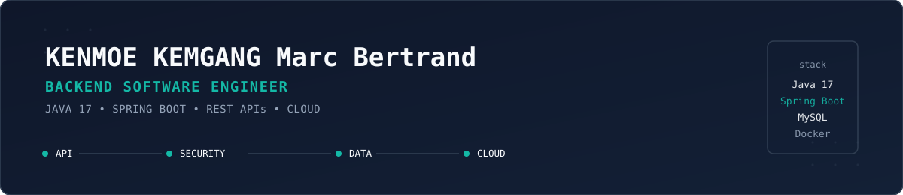
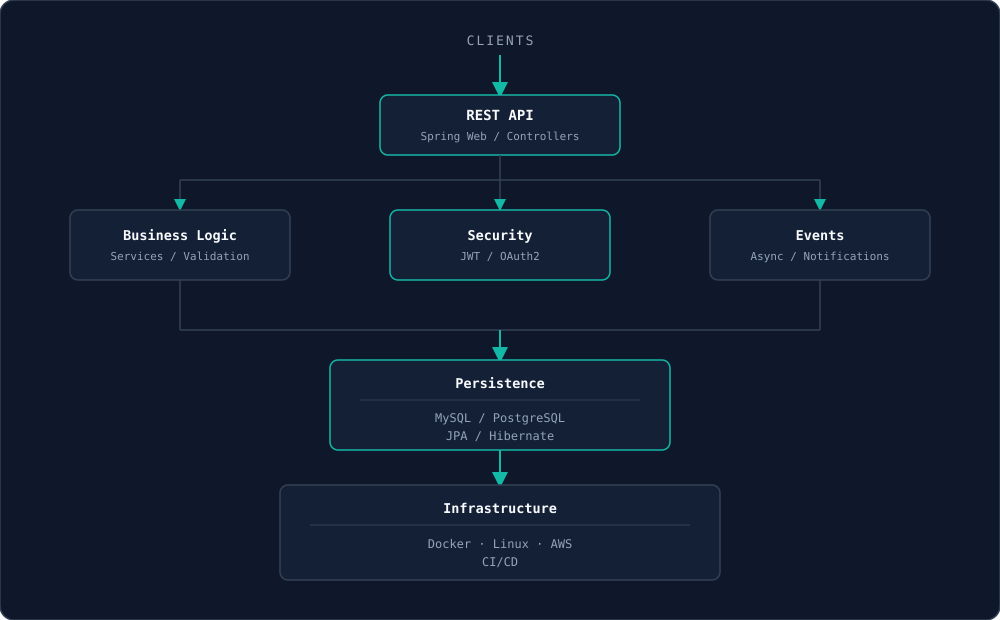
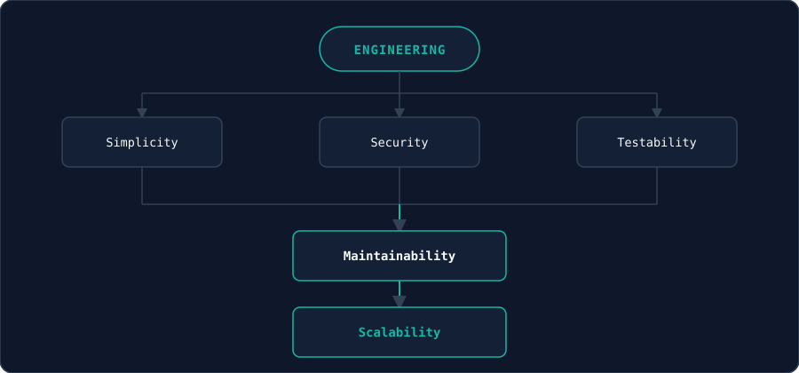
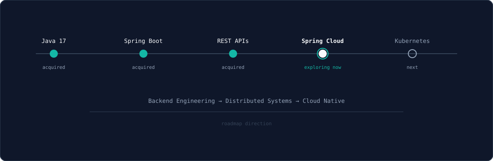
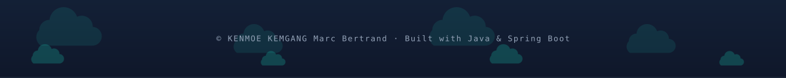

<div align="center">
  

  <!-- Typing SVG animé -->
  <a href="https://[votre-portfolio].vercel.app">
    
  </a>
</div>

<br/>

<!-- SVG #1 — Identité -->
<div align="center">
  
</div>

<br/>

## 👋 About Me

> Backend Software Engineer focused on building robust,
> secure and maintainable applications with Java and Spring Boot.

```java
public final class Developer {

    String name = "KENMOE KEMGANG Marc Bertrand";
    String role = "Backend Software Engineer";
    String location = "Bafoussam, Cameroon";

    String language  = "Java 17";
    String framework = "Spring Boot";

    String[] principles = {
        "Clean Architecture",
        "SOLID",
        "DDD",
        "Security",
        "Testing"
    };
}
```

---

## 🏗️ Backend Architecture

<div align="center">
  
</div>

I design REST APIs on Spring Boot with clear separation between business logic, security (JWT/OAuth2) and asynchronous events, backed by relational persistence and containerized infrastructure.

---

## 🧠 Engineering Principles

<div align="center">
  
</div>

- **Simple** — Prefer understandable solutions over clever ones.
- **Tested** — Design for confidence and regression safety.
- **Secure** — Treat authentication and authorization as first-class concerns.
- **Maintainable** — Keep responsibilities clear and boundaries explicit.
- **Scalable** — Design with future growth in mind.

---

## 🛠️ Tech Stack

### ☕ Backend
   

### 🌐 Web
   

### 🗄️ Data
  

### 🐳 DevOps & Infrastructure
   

### 🔐 Security
 

<p align="center">
  
</p>

---

## 🚀 Featured Projects

<table>
<tr>
<td width="100%">

### 🧺 Vividela — Pressing Management System

**Problem:** dry-cleaning shops need to track orders, stock, payments and customer notifications reliably, with no room for state inconsistencies (double payments, lost tickets, silent failures).

**Solution:** a Spring Boot backend implementing a full order lifecycle state machine, JWT authentication with a MySQL-backed token blacklist (scheduled cleanup, no Redis dependency), a typed `BusinessException` hierarchy with a polymorphic global exception handler, and an async notification pipeline (email, SMS, in-app) that fires reliably after transaction commit — paired with a React/Tailwind frontend.

`Java 17` · `Spring Boot` · `Spring Security` · `JPA/Hibernate` · `MySQL` · `React` · `Docker`

[🔗 Repository](https://github.com/KENMOEmarc/Vividela/tree/main/laundry-backend)· [📄 Documentation](https://github.com/KENMOEmarc/Vividela/blob/main/laundry-backend/README.md)

</td>
</tr>
</table>

---

## 🧭 Currently Exploring

<div align="center">
  
</div>

---

## 📊 GitHub Activity

<div align="center">
  
  
</div>

---

## 🌐 Connect With Me

<p align="center">
  <a href="https://www.linkedin.com/in/marc-bertrand-kenmoe-kemgang-a7a876305/" target="_blank"></a>
  <a href="https://x.com/@VrathAdVitam" target="_blank"></a>
  <a href="https://github.com/KENMOEmarc" target="_blank"></a>
  <a href="mailto:kenmoe.bertrand@hotmail.com" target="_blank"></a>
</p>

<br/>

<div align="center">
  
</div>
